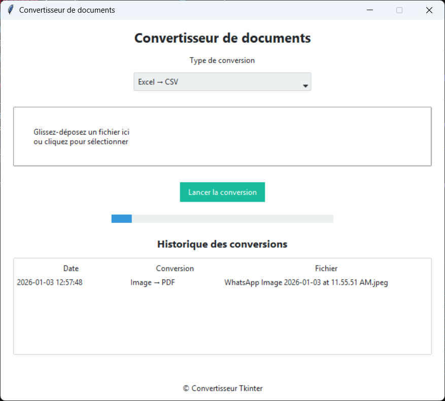

# 🧱 1. PRÉPARER LE PROJET (AVANT GITHUB)

### 📁 Structure

```
document-converter/
│
├── main.py
├── converters.py
├── history.csv
├── requirements.txt
├── README.md
├── .gitignore
```

---

# 📝 2. CRÉER LES FICHIERS ESSENTIELS

## ✅ `requirements.txt`

```txt
ttkbootstrap
pandas
pillow
fpdf
python-docx
tkinterdnd2
```

---

## ✅ `.gitignore` (TRÈS IMPORTANT)

👉 Pour éviter d’envoyer des fichiers inutiles ou sensibles

```gitignore
# Python
__pycache__/
*.pyc
*.pyo
*.pyd

# Environnements
venv/
.env

# Historique local
history.csv

# OS
.DS_Store
Thumbs.db

# Packaging
build/
dist/
*.spec
```

---

## ✅ `README.md` (simple mais propre)

````md
# 📄 Document Converter (Tkinter)

Application desktop développée en Python avec Tkinter pour convertir des documents.

## ✨ Fonctionnalités
- Conversion Excel ↔ CSV
- Conversion Word → PDF
- Conversion Images (JPEG/PNG) → PDF
- Drag & Drop
- Barre de progression
- Historique des conversions
- Interface moderne (ttkbootstrap)

## 🛠️ Installation
```bash
pip install -r requirements.txt
python main.py
````

## 📦 Packaging

L'application peut être packagée en `.exe` avec PyInstaller.

## 📸 Aperçu



## 👤 Auteur

Harold Pascal ATCHEKPE

````
