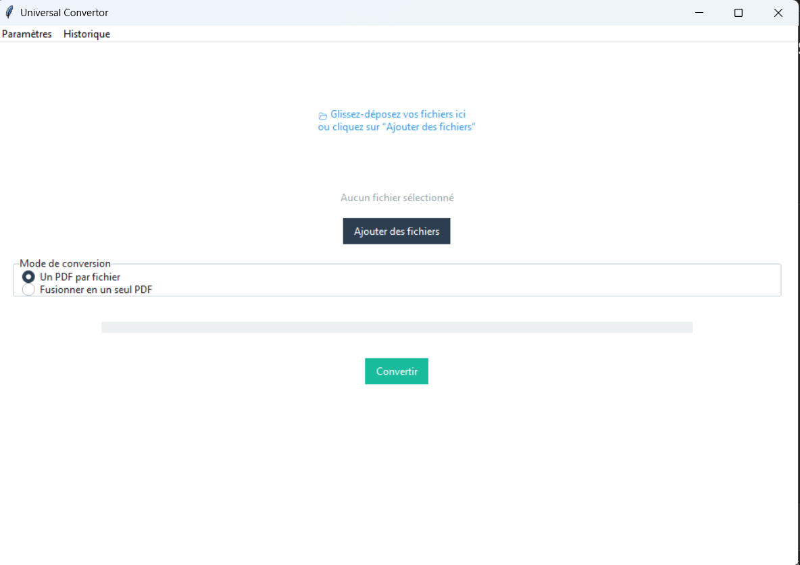

````md
# 📄 Document Converter (Tkinter)

Application desktop développée en Python avec Tkinter pour convertir des documents.

## ✨ Fonctionnalités
- Conversion Excel ↔ CSV
- Conversion Word → PDF
- Conversion Images (JPEG/PNG) → PDF
- Drag & Drop
- Barre de progression
- Historique des conversions
- Interface moderne (ttkbootstrap)

## 🛠️ Installation
```bash
pip install -r requirements.txt
python main.py
````

## 📦 Packaging

L'application peut être packagée en `.exe` avec PyInstaller.

## 📸 Aperçu



## 👤 Auteur

Harold Pascal ATCHEKPE
